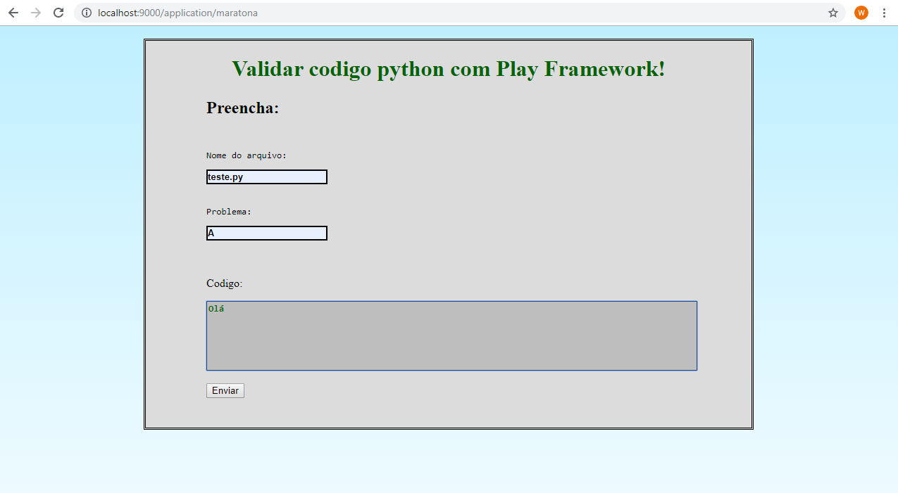
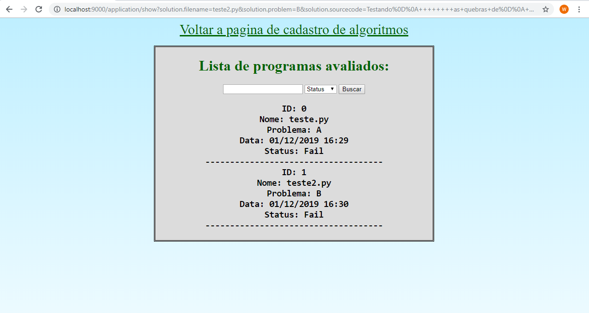

# Validação de códigos .py de maratonas
 O projeto web tem a função de validar códigos python (.py) através de comparação de arquivo de saida do algoritmo postado e o arquivo de saida esperado.  
 
## Endpoint /maratona: 
 É a página principal onde o usuário irá postar o código juntamente com o nome do arquivo e nome do problema (ID).  
 Após a postagem do algoritmo, a aplicação faz as validações e retorna com "SUCCESS" ou "FAIL" dependendo da comparação do arquivo de saída.  
### Demonstração:  
   
   
## Endpoint /show: 
 É a página para exibir um histórico dos códigos postados, incluindo data, hora e o status ("SUCCESS" ou "FAIL").  
### Demonstração:  
  

## Requisitos:
- JRE 1.8.0
- Play Framework 1.5.3

## Importar projeto
Para a utilização da versão 1.5.3 do framework Play, necessita apenas realizar o [download do arquivo compactado](https://www.playframework.com/releases) e usar o Prompt de comando dentro da pasta do framework.

### Comandos para o Play framework
No diretório do Play:
- Comando play + (nome do projeto a ser iniciado);
- Comando play new + (nome do projeto a ser criado);
- Comando play eclipsify + (nome do projeto a ser configurado para utilização na IDE Eclipse)  
 *obs: O comando "play eclipsify ..." pode ser alterado dependendo da IDE que o desenvolvedor deseja utilizar. Para mais informações consultar a [documentação](https://www.playframework.com/documentation/1.5.x/ide)*
 
